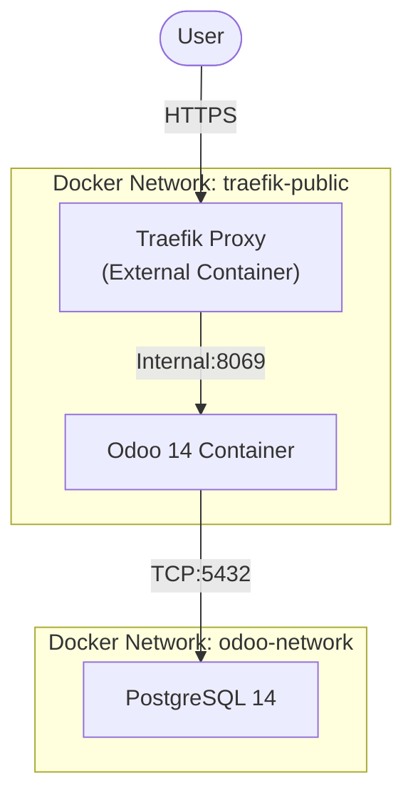
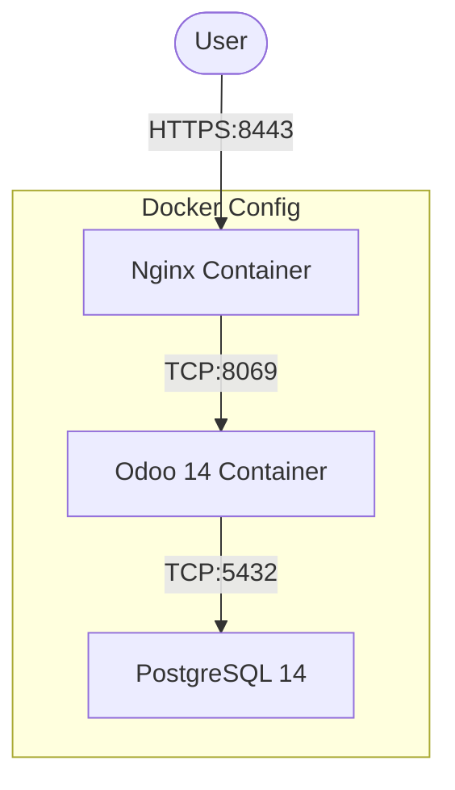

# Odoo 14 Dockerized Deployment

This repository contains a secure, Dockerized deployment of Odoo 14 with PostgreSQL 14. It includes built-in support for two reverse proxy architectures: **Traefik** (recommended for existing stacks) and **Nginx** (standalone).

## Repository Content

*   **`odoo.yaml`**: Standard setup with local Nginx on port 8088.
*   **`odoo-traefik.yaml`**: Integrated setup using Traefik (Auto-HTTPS).
*   **`odoo-nginx.yaml`**: Standalone setup with Nginx handling HTTPS (Self-signed).
*   **`config/`**: Configuration files for Odoo and Nginx.
*   **`secrets/`**: Directory for storing sensitive passwords (excluded from git).
*   **`.env`**: Environment variables for non-sensitive config.

## Architecture

We provide two main ways to deploy this stack:

### Option A: Traefik (Recommended)
Best if you already have a Traefik instance running. It uses Docker labels to automatically route traffic.



### Option B: Nginx (Standalone)
Best for standalone servers. Uses a sidecar Nginx container to handle SSL/TLS.



## Security Features
*   **Secrets Management**: Passwords are securely mounted via Docker secrets, not plain text in environment variables, using `/run/secrets/`.
*   **Proxy Mode**: Odoo configured with `proxy_mode = True` to correctly handle `X-Forwarded-*` headers.

## Deployment Tutorial

### Prerequisites
1.  **Docker & Docker Compose** installed.
2.  **Git** installed.

### Step 1: Clone & Configure
```bash
git clone https://github.com/naufalseira/odoo-14.git
cd odoo-14
```

Create your `.env` file:
```bash
cp .env.example .env
# Edit .env to match your needs
```

### Step 2: Set Up Secrets
Create the secrets directory and files. These are **not** committed to Git.
```bash
mkdir -p secrets
echo "your_strong_db_password" > secrets/db_password
echo "your_strong_master_password" > secrets/odoo_password
```

### Step 3: Choose Your Deployment

#### Variant 1: Traefik (Production Recommended)
Ensure your Traefik network exists (default: `traefik-public` in the file).
```bash
# Update network name if different
vim odoo-traefik.yaml 

# Deploy
docker compose -f odoo-traefik.yaml up -d
```
*Access:* `https://odoo.naseira.com`

#### Variant 2: Nginx (Standalone HTTPS)
Uses self-signed certificates generated in `config/`.
```bash
# Generate certs if missing
openssl req -x509 -nodes -days 365 -newkey rsa:2048 \
    -keyout config/nginx.key -out config/nginx.crt \
    -subj "/CN=odoo.naseira.com"

# Deploy
docker compose -f odoo-nginx.yaml up -d
```
*Access:* `https://your-server-ip:8443`

#### Variant 3: Standard (Local Testing)
Runs Nginx on port 8088.
```bash
docker compose -f odoo.yaml up -d
```
*Access:* `http://localhost:8088`

## Management

**Restart Odoo:**
```bash
docker compose -f odoo-traefik.yaml restart odoo-web
```

**View Logs:**
```bash
docker compose -f odoo-traefik.yaml logs -f
```
