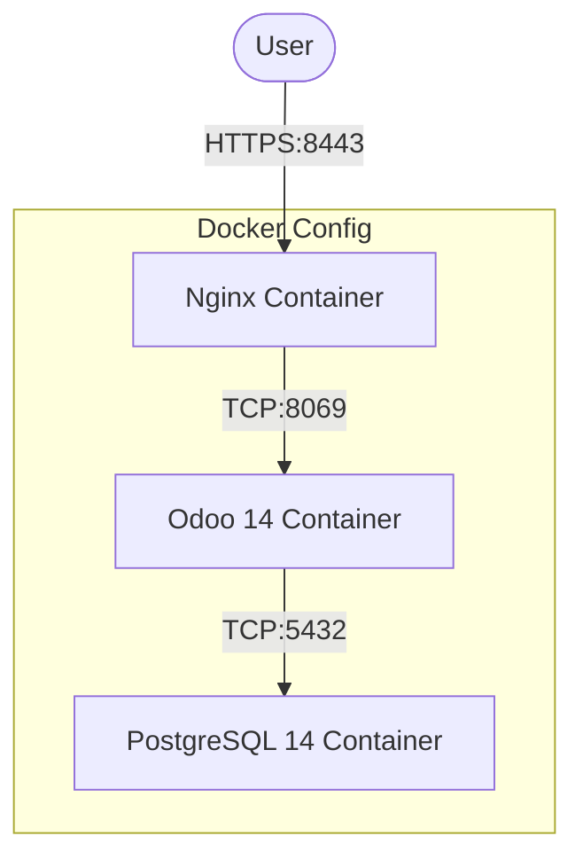

# Odoo 14 Dockerized Deployment

This repository contains a secure, Dockerized deployment of Odoo 14 with PostgreSQL 14. It includes built-in support for two reverse proxy architectures: **Traefik** (recommended for existing stacks) and **Nginx** (standalone).

## Repository Content

*   **`odoo.yaml`**: Standard setup with local Nginx on port 8088.
*   **`odoo-traefik.yaml`**: Integrated setup using Traefik (Auto-HTTPS).
*   **`odoo-nginx.yaml`**: Standalone setup with Nginx handling HTTPS (Self-signed).
*   **`traefik.yaml`**: Standalone Traefik reverse proxy with Let's Encrypt and dashboard.
*   **`config/`**: Configuration files for Odoo and Nginx.
*   **`secrets/`**: Directory for storing sensitive passwords (excluded from git).
*   **`.env`**: Environment variables for non-sensitive config.

## Architecture

We provide two main ways to deploy this stack:

### Option A: Traefik (Recommended)
Best if you already have a Traefik instance running, or deploy one using the included `traefik.yaml`. It uses Docker labels to automatically route traffic and obtain Let's Encrypt certificates.

```mermaid
graph TD
graph TD
    User([User]) -->|HTTPS:443| Traefik("Traefik 3.3")
    User -->|HTTP:80| Traefik

    subgraph "External Network: traefik"
        Traefik -->|Internal:8069| Odoo("Odoo 14")
    end
    
    subgraph "Internal Network: odoo"
        Odoo -->|TCP:5432| DB("PostgreSQL 14")
    end
```

> **Note:** Both `odoo-traefik.yaml` and `traefik.yaml` require the external Docker network `traefik-public` to be created before deployment.

### Option B: Nginx (Standalone)
Best for standalone servers. Uses a sidecar Nginx container to handle SSL/TLS.



## Security Features
*   **Secrets Management**: Database password is provided via Docker secret `pg_password` (mounted at `/run/secrets/pg_password`). The Odoo master admin password is defined directly in `config/odoo.conf` (`admin_passwd`) and is **not** stored in `.env` or Docker secrets.
*   **Proxy Mode**: Odoo configured with `proxy_mode = True` to correctly handle `X-Forwarded-*` headers.

## Deployment Tutorial

### Prerequisites
1.  **Docker & Docker Compose** installed.
2.  **Git** installed.

### Step 1: Clone & Configure
```bash
git clone https://github.com/naufalseira/odoo-14.git
cd odoo-14
```

Create your `.env` file:
```bash
cp .env.example .env
# Edit .env to match your needs
```

### Step 2: Set Up Secrets
Create the secrets directory and files. These are **not** committed to Git.
```bash
mkdir -p secrets
echo "your_strong_db_password" > secrets/pg_password
# Odoo master password is set in config/odoo.conf
```

### Step 3: Create External Docker Network

Before deploying with Traefik, you must create the external network:
```bash
docker network create traefik-public
```

### Step 4: Choose Your Deployment

#### Variant 1: Traefik
If you need a new Traefik instance, first configure your `.env` with Traefik variables:
```bash
# Required variables for traefik.yaml
DOMAIN=domain.com
ACME_EMAIL=your-email@example.com
USERNAME=admin
HASHED_PASSWORD=$(htpasswd -nB admin | sed -e 's/\$/\$\$/g')
```

Then deploy:
```bash
# Deploy Traefik first
docker compose -f traefik.yaml up -d

# Deploy Odoo
docker compose -f odoo-traefik.yaml up -d
```

*Access:* `https://${SUB_DOMAIN}` (e.g., `https://odoo.domain.com`)
*Traefik Dashboard:* `https://traefik.domain.com`

#### Variant 2: Nginx
Uses self-signed certificates generated in `config/`.
```bash
# Generate certs if missing
openssl req -x509 -nodes -days 365 -newkey rsa:2048 \
    -keyout config/nginx.key -out config/nginx.crt \
    -subj "/CN=odoo.domain.com"

# Deploy
docker compose -f odoo-nginx.yaml up -d
```
*Access:* `https://your-server-ip:8443`

#### Variant 3: Standard (Local Testing)
Runs Nginx on port 8088.
```bash
docker compose -f odoo.yaml up -d
```
*Access:* `http://localhost:8088`

## Management

**Restart Odoo:**
```bash
docker compose -f odoo-traefik.yaml restart odoo-web
```

**View Logs:**
```bash
docker compose -f odoo-traefik.yaml logs -f
```
