# Odoo 14 Dockerized Deployment

Deploy Odoo 14 ERP with PostgreSQL 14 using Docker. This guide provides **production-ready** deployment with automatic HTTPS certificates via Traefik reverse proxy.

---

## What's Inside

| File | Description |
|------|-------------|
| `traefik.yaml` | Traefik reverse proxy (handles HTTPS) |
| `traefik-swarm.yaml` | **Traefik for Docker Swarm mode** |
| `odoo-traefik.yaml` | Odoo + PostgreSQL stack (single instance) |
| `odoo-swarm.yaml` | **Odoo HA stack (Docker Swarm)** |
| `odoo-nginx.yaml` | Alternative: Odoo with Nginx (self-signed SSL) |
| `odoo.yaml` | Alternative: Basic setup for local testing |
| `config/` | Odoo and Nginx configuration files |
| `scripts/` | **Helper scripts for Swarm management** |
| `secrets/` | Password files (not committed to Git) |
| `.env` | Environment variables |

---

## Architecture Overview

```mermaid
graph TD
    User([User]) -->|HTTPS:443| Traefik
    User -->|HTTP:80| Traefik

    subgraph "Docker Host"
        subgraph "traefik-public network"
            Traefik["🔒 Traefik 3.3<br/>Reverse Proxy"]
            Traefik -->|Port 8069| Odoo["📦 Odoo 14<br/>ERP Application"]
        end

        subgraph "odoo network"
            Odoo -->|Port 5432| DB["🗄️ PostgreSQL 14<br/>Database"]
        end

    end
```



### How It Works

1. **Traefik** listens on ports 80 (HTTP) and 443 (HTTPS)
2. **Traefik** automatically obtains SSL certificates from Let's Encrypt
3. **Traefik** routes requests to Odoo based on domain name
4. **Odoo** connects to PostgreSQL for data storage
5. All traffic is encrypted with HTTPS

---

## Prerequisites

Before you begin, ensure you have:

- [ ] **VPS/Server** with public IP address
- [ ] **Domain name** pointing to your server (e.g., `odoo.example.com`)
- [ ] **Docker** installed ([Install Guide](https://docs.docker.com/engine/install/))
- [ ] **Docker Compose** v2+ installed
- [ ] **Ports 80 and 443** open in your firewall

### Verify Docker Installation

```bash
# Check Docker version (should be 20.10+)
docker --version

# Check Docker Compose version (should be 2.0+)
docker compose version
```

---

## Quick Start Guide

### Step 1: Clone the Repository

```bash
git clone https://github.com/naufalseira/odoo-14.git
cd odoo-14
```

### Step 2: Create Docker Network

Traefik and Odoo communicate through a shared Docker network. Create it first:

```bash
docker network create traefik-public
```

> **Why?** Docker networks isolate containers. The `traefik-public` network allows Traefik to discover and route traffic to Odoo.

### Step 3: Set Up Database Password

Create a secure password for PostgreSQL:

```bash
# Create secrets directory
mkdir -p secrets

# Generate a strong password and save it
echo "your_strong_database_password_here" > secrets/pg_password.txt

# Secure the file permissions
chmod 600 secrets/pg_password.txt
```

> **Security Note:** This password is mounted as a Docker secret, not exposed in environment variables.

### Step 4: Generate Traefik Dashboard Password

Traefik has a web dashboard for monitoring. Protect it with a password:

```bash
# Generate bcrypt-hashed password
# Replace 'admin' and 'your_password' with your desired credentials
docker run --rm httpd:alpine htpasswd -n -b -B admin your_password
```

**Example output:**
```
admin:$2y$05$UHw.pfAQObWpSjqiqYGC0Ox.8ijkd6p2EgiDn2bRF1af8n9g29Uji
```

Copy the **hash part only** (everything after `admin:`).

### Step 5: Configure Environment Variables

```bash
# Copy the example file
cp .env.example .env

# Edit the file
nano .env
```

Update these values in `.env`:

```bash
# Your main domain (used for Traefik dashboard)
DOMAIN=example.com

# Subdomain where Odoo will be accessible (optional)
SUB_DOMAIN=odoo.example.com

# Email for Let's Encrypt notifications (certificate expiry warnings)
ACME_EMAIL=admin@example.com

# Traefik dashboard credentials
USERNAME=admin
HASHED_PASSWORD=$2y$05$UHw.pfAQObWpSjqiqYGC0Ox.8ijkd6p2EgiDn2bRF1af8n9g29Uji
```

> **💡 Deploying on Main Domain:** If you want Odoo accessible directly on your main domain (e.g., `example.com` instead of `odoo.example.com`), edit `odoo-traefik.yaml` and change `${SUB_DOMAIN}` to `${DOMAIN}` in the Traefik labels.

### Step 6: Deploy Traefik

```bash
docker compose -f traefik.yaml up -d
```

**Verify Traefik is running:**
```bash
docker compose -f traefik.yaml ps
```

Expected output:
```
NAME      IMAGE          STATUS
traefik   traefik:3.3    Up X minutes
```

### Step 7: Deploy Odoo

```bash
docker compose -f odoo-traefik.yaml up -d
```

**Verify Odoo is running:**
```bash
docker compose -f odoo-traefik.yaml ps
```

Expected output:
```
NAME        IMAGE          STATUS
odoo-web    odoo:14        Up X minutes
odoo-db     postgres:14    Up X minutes (healthy)
```

### Step 8: Access Odoo

Wait 1-2 minutes for SSL certificate generation, then open:

- **Odoo:** `https://odoo.example.com`
- **Traefik Dashboard:** `https://traefik.example.com`

**Default Odoo Credentials:**
- Email: `admin`
- Password: `admin`

> ⚠️ **Important:** Change the default password immediately after first login!

---

## Security Features

| Feature | Description |
|---------|-------------|
| **Docker Secrets** | Database password stored in `/run/secrets/pg_password`, not in environment variables |
| **HTTPS Everywhere** | All traffic encrypted with Let's Encrypt certificates |
| **Network Isolation** | PostgreSQL only accessible from Odoo container |
| **Proxy Mode** | Odoo correctly handles `X-Forwarded-*` headers |

---

## Management Commands

### Restart Services

```bash
# Restart Odoo only
docker compose -f odoo-traefik.yaml restart odoo-web

# Restart entire Odoo stack
docker compose -f odoo-traefik.yaml restart

# Restart Traefik
docker compose -f traefik.yaml restart
```

### Stop Services

```bash
# Stop Odoo (keeps data)
docker compose -f odoo-traefik.yaml down

# Stop Traefik
docker compose -f traefik.yaml down

# ⚠️ Stop and DELETE all data
docker compose -f odoo-traefik.yaml down -v
```

### View Logs

```bash
# Odoo logs (live)
docker compose -f odoo-traefik.yaml logs -f odoo-web

# Database logs
docker compose -f odoo-traefik.yaml logs -f odoo-db

# Traefik logs
docker compose -f traefik.yaml logs -f
```

---

## Verification Checklist

After deployment, verify everything works:

### 1. Check Container Status

```bash
docker compose -f traefik.yaml ps
docker compose -f odoo-traefik.yaml ps
```

All containers should show `Up` status.

### 2. Check Network Connection

```bash
docker network inspect traefik-public --format '{{range .Containers}}{{.Name}} {{end}}'
```

Should list: `traefik odoo-web`

### 3. Test HTTPS

```bash
curl -I https://odoo.example.com
```

Should return `HTTP/2 200` or redirect to login.

### 4. Test Database

```bash
docker compose -f odoo-traefik.yaml exec odoo-db psql -U odoo -d postgres -c '\l'
```

Should list available databases.

---

## Troubleshooting

### Problem: "Bad Gateway" (502 Error)

**Cause:** Odoo container is not running or not connected to Traefik network.

```bash
# Check container status
docker compose -f odoo-traefik.yaml ps

# Check Odoo logs for errors
docker compose -f odoo-traefik.yaml logs --tail=50 odoo-web

# Verify network connection
docker network inspect traefik-public
```

### Problem: "Internal Server Error" on First Access

**Cause:** Database not initialized.

```bash
# Stop Odoo
docker compose -f odoo-traefik.yaml stop odoo-web

# Initialize database
docker compose -f odoo-traefik.yaml run --rm odoo-web odoo -i base -d odoo --stop-after-init

# Start Odoo
docker compose -f odoo-traefik.yaml start odoo-web
```

### Problem: SSL Certificate Not Working

**Cause:** Let's Encrypt couldn't issue certificate.

```bash
# Check Traefik logs for ACME errors
docker compose -f traefik.yaml logs | grep -i acme

# Verify DNS points to your server
dig +short odoo.example.com

# Verify ports are open
curl -4 ifconfig.me  # Your public IP
```

**Common causes:**
- DNS not pointing to server
- Ports 80/443 blocked by firewall
- Rate limit exceeded (wait 1 hour)

### Problem: Database Connection Failed

**Cause:** Password mismatch or database not ready.

```bash
# Check database status
docker compose -f odoo-traefik.yaml ps odoo-db

# Test connection
docker compose -f odoo-traefik.yaml exec odoo-db pg_isready -U odoo

# Verify secret is mounted
docker compose -f odoo-traefik.yaml exec odoo-web cat /run/secrets/pg_password
```

### Problem: Traefik Dashboard Not Accessible

**Cause:** Wrong password or container not running.

```bash
# Check container
docker compose -f traefik.yaml ps

# Verify password hash in environment
docker compose -f traefik.yaml config | grep HASHED_PASSWORD
```

---

## Debug Commands

```bash
# Enter Odoo container
docker compose -f odoo-traefik.yaml exec odoo-web bash

# Enter database container
docker compose -f odoo-traefik.yaml exec odoo-db bash

# Enter Traefik container
docker compose -f traefik.yaml exec traefik sh

# View all Docker networks
docker network ls

# Monitor resource usage
docker stats odoo-web odoo-db traefik
```

---

## 🚀 Docker Swarm High Availability Deployment

For production environments requiring horizontal scaling, load balancing, and high availability.

### HA Architecture


### Features

| Feature | Description |
|---------|-------------|
| **Load Balancing** | Traefik distributes traffic across replicas |
| **Sticky Sessions** | Users stay on same replica via cookies |
| **Rolling Updates** | Zero-downtime deployments |
| **Auto-restart** | Failed containers automatically restart |
| **Resource Limits** | CPU/Memory limits prevent resource exhaustion |

### Quick Start (Swarm Mode)

```bash
# 1. Initialize Swarm
./scripts/init-swarm.sh

# 2. Deploy Traefik
docker stack deploy -c traefik-swarm.yaml traefik

# 3. Deploy Odoo HA
docker stack deploy -c odoo-swarm.yaml odoo-stack

# 4. Check status
docker service ls
```

### Scaling

```bash
# Scale to 3 replicas
./scripts/scale-odoo.sh 3

# Or manually
docker service scale odoo-stack_odoo-web=3
```

### Backup

```bash
# Manual backup
./scripts/backup-postgres.sh

# Setup daily backup (02:00 WIB)
crontab -e
# Add: 0 19 * * * /home/seira/odoo/scripts/backup-postgres.sh >> /var/log/odoo-backup.log 2>&1
```

### Helper Scripts

| Script | Description |
|--------|-------------|
| `scripts/init-swarm.sh` | Initialize Docker Swarm cluster |
| `scripts/deploy-stack.sh` | Deploy Odoo stack with checks |
| `scripts/scale-odoo.sh` | Scale Odoo replicas |
| `scripts/backup-postgres.sh` | Database backup with retention |
| `scripts/check-health.sh` | Health check all services |

### Useful Swarm Commands

```bash
# View all services
docker service ls

# View service logs
docker service logs -f odoo-stack_odoo-web

# View replica details
docker service ps odoo-stack_odoo-web

# Force update (rolling restart)
docker service update --force odoo-stack_odoo-web

# Remove stack
docker stack rm odoo-stack
```

---

## Alternative Deployments

### Nginx (Self-Signed SSL)

For servers without domain name:

```bash
# Generate self-signed certificate
openssl req -x509 -nodes -days 365 -newkey rsa:2048 \
    -keyout config/nginx.key -out config/nginx.crt \
    -subj "/CN=localhost"

# Deploy
docker compose -f odoo-nginx.yaml up -d
```

Access: `https://your-server-ip:8443`

### Local Development

For local testing without HTTPS:

```bash
docker compose -f odoo.yaml up -d
```

Access: `http://localhost:8088`

---

## License

This project is open source. Odoo Community Edition is licensed under LGPL.
